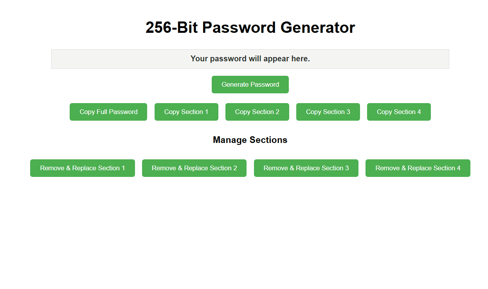

# 🔐 256-Bit Password Generator

<p align="center">
  
</p>

A lightweight browser-based password generation tool built with HTML, CSS, and JavaScript that creates secure 256-bit passwords with flexible copy and section management capabilities.

Designed to provide a simple and user-friendly interface for generating high-entropy passwords while allowing users to copy or regenerate specific password segments without affecting the entire credential.

---

<p align="left">
  
  
  
  
  
</p>

---

## 🎬 Demo

<p align="center">
  
</p>

---

# 🚀 Features

- Generates secure 256-bit passwords
- High-entropy randomization
- Fully browser-based (no backend required)
- Copy full password instantly
- Copy individual password sections
- Replace specific password segments
- Works offline after download
- No installation required

---

# 🛠 Technologies

- HTML5
- CSS3
- JavaScript (ES6)

---

# 📖 How to Use

## Option 1 — Open Locally

1. Download or clone the repository  
2. Open:

```text
256-Bit Password Generator with Easy Copy Options.html
```

3. Open in any modern browser  
4. Click **Generate Password**  
5. Use copy buttons for full or partial passwords  

---

## Option 2 — Git Clone

```bash
git clone https://github.com/tcdoverlord/256-Bit-Password-Generator.git
cd 256-Bit-Password-Generator
```

Then open the HTML file in your browser.

---

# 📊 Example Output

### Generated Password
```
X7d@9Kp!Lm3#Qz8... (256-bit output)
```

### Capabilities
- Full password copy
- Section-based copy
- Regenerate individual segments

---

# 📂 Project Structure

```
256-Bit-Password-Generator/
│
├── 256-Bit Password Generator with Easy Copy Options.html
├── 256-bit-password-generator-demo.gif
├── README.md
└── LICENSE
```

---

# 💡 Use Cases

- Secure password generation
- Cybersecurity learning
- Developer utilities
- Credential management tools
- Web development practice
- Encryption awareness training

---

# 🤝 Contributing

Contributions are welcome.

Feel free to open issues or submit pull requests.

---

# 👨‍💻 Author

**TCDOverLord**

GitHub: https://github.com/tcdoverlord

---

# 📜 License

This project is licensed under the MIT License.
